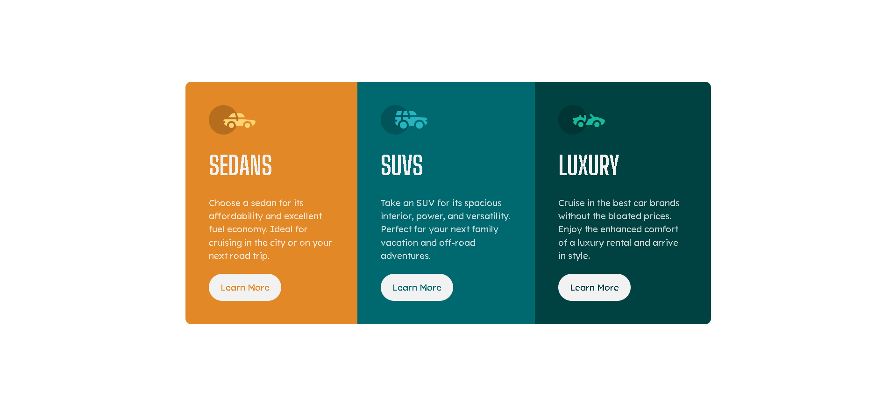

# Frontend Mentor - 3-column preview card component solution

This is my solution to the [3-column preview card component challenge on Frontend Mentor](https://www.frontendmentor.io/challenges/3column-preview-card-component-pH92eAR2-). This challenge helped me improve my skills in responsive design and component-based development.

## Table of contents

- [Overview](#overview)
  - [The challenge](#the-challenge)
  - [Screenshot](#screenshot)
  - [Links](#links)
- [My process](#my-process)
  - [Built with](#built-with)
  - [What I learned](#what-i-learned)
  - [Continued development](#continued-development)
- [Author](#author)

## Overview

### The challenge

Users should be able to:

- View the optimal layout depending on their device's screen size.
- See hover states for interactive elements.

### Screenshot

### Links

- [Solution URL](https://github.com/ffozdemir/3-column-preview-card-component)
- [Live Site URL](https://snazzy-tartufo-39172e.netlify.app)

## My process

### Built with

- Semantic HTML5 markup
- CSS custom properties
- Flexbox
- Mobile-first workflow

### What I learned

While working on this project, I learned how to effectively use Flexbox for layout design and how to implement hover states for interactive elements.

### Continued development

In future projects, I plan to focus more on accessibility and improving my skills in CSS Grid for more complex layouts.

## Author

- Frontend Mentor - [@ffozdemir](https://www.frontendmentor.io/profile/ffozdemir)
- GitHub - [ffozdemir](https://github.com/ffozdemir)
